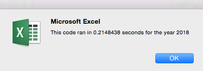

# An Analysis of Selected Stocks and the Benefits of Refactoring Scripts

## Overview of Project
The following is an analysis of the benefits of refactoring a VBA script created to analyze the performance of 12 selected green energy stocks for the years 2017 and 2018. The script was initially written to provide insights to the client, Steve, who has been tasked with investing in stocks for his parents, who are passionate about green energy and are particularly interested in the performance of a company called DAQO New Energy Corp (ticker “DQ”). The script was then refactored to allow the client to easily and efficiently scale his stock analysis to include the performance of any or all stocks on the market for any given year. To determine whether the refactoring improved the original script, run times were calculated for compared for both. 

## Results

### Script Comparison

The primary objective in refactoring the VBA script was to allow it to better handle much larger datasets than the one included in this analysis (3013 rows). To do this, attention was given to removing processes that slow a script when processing large datasets, which in this case was a nested for loop (shown below): 

#### Original Script (before refactoring:

    'Loop through tickers
    For i = 0 To 11
        
        ticker = tickers(i)
        totalVolume = 0
        
            ‘Loop through rows in the data
            Worksheets(yearValue).Activate
            For j = 2 To RowCount
            
                'Get total volume for current ticker
                If Cells(j, 1).Value = ticker Then

                totalVolume = totalVolume + Cells(j, 8).Value

                End If
                
                ‘Get starting price for current ticker
                If Cells(j - 1, 1).Value <> ticker And Cells(j, 1).Value = ticker Then

                startingPrice = Cells(j, 6).Value

                End If
                
                ‘Get ending price for current ticker
                If Cells(j + 1, 1).Value <> ticker And Cells(j, 1).Value = ticker Then

                endingPrice = Cells(j, 6).Value
                
                End If
                 
            Next j
            
            'Output data for current ticker
            Worksheets("All Stocks Analysis").Activate
            Cells(4 + i, 1).Value = ticker
            Cells(4 + i, 2).Value = totalVolume
            Cells(4 + i, 3).Value = endingPrice / startingPrice - 1
            
        Next i

The first for loop is initialized to loop through an array of stock ticker names, and then a nested for loop is used to calculate a total volume and yearly return for the given ticker using a series of conditional statements. This information is then outputted before the loop begins again for the next ticker. In contrast, the refactored script does not use a nested for loop and instead uses a variable (tickerIndex), to access the correct index across a series of arrays created to collect the generated output. The result is three separate for loops and can be seen below: 

#### Refactored Script:  

    'Create a ticker Index
    tickerIndex = 0

    'Create three output arrays
    Dim tickerVolumes(12) As Long
    Dim tickerStartingPrices(12) As Single
    Dim tickerEndingPrices(12) As Single
    
    'Create a for loop to initialize the tickerVolumes to zero.
    
    For i = 0 To 11
    
        
        tickerVolumes(i) = 0
        
    Next i
    
            
           'Loop over all the rows in the spreadsheet.
    
    For i = 2 To RowCount
        
        'Increase volume for current ticker
        
       
        tickerVolumes(tickerIndex) = tickerVolumes(tickerIndex) + Cells(i, 8).Value

       
        'Check if the current row is the first row with the selected tickerIndex.
        
        If Cells(i - 1, 1).Value <> tickers(tickerIndex) Then

            tickerStartingPrices(tickerIndex) = Cells(i, 6).Value

        End If
        
        ‘Check if the current row is the last row with the selected ticker
        
        If Cells(i + 1, 1).Value <> tickers(tickerIndex) Then

            tickerEndingPrices(tickerIndex) = Cells(i, 6).Value
        
            '3d Increase the tickerIndex.
            tickerIndex = tickerIndex + 1
            
        End If
    
    Next i
    
    'Loop through your arrays to output the Ticker, Total Daily Volume, and Return.
    For i = 0 To 11
        
        Worksheets("All Stocks Analysis").Activate
        Cells(4 + i, 1).Value = tickers(i)
        Cells(4 + i, 2).Value = tickerVolumes(i)
        Cells(4 + i, 3).Value = tickerEndingPrices(i) / tickerStartingPrices(i) - 1
        
    Next i

As can be seen, the second loop contains the same calculations originally found in the nested for loop, except that in the refactored version the tickerIndex increases every time it is determined that the ticker value changes between the current row and the next. To determine whether the refactoring was effective, the run time of both scripts was calculated within the script using VBA's timer operator for both the 2017 and the 2018 data. The difference is clear: by eliminating the nested for loop found in the original script, the refactored script ran about 1.2 seconds faster for the 2017 data and about 1.5 seconds for the 2018 data. The exact run times were as follows: 

#### Original Script Run Times

 
#### Refactored Script Run Times

 

### Stock Perfomance

In total, 12 green energy stocks were analyzed over two years, 2017 and 2018. In this analysis, the stocks are referenced by their ticker, an abbreviation used to identify stocks on the market. The indices used to measure stock performance were the total daily volume (a measure of how often the stock was traded), and the yearly return (the percentage difference in stock price from the beginning to the end of the year). Negative yearly returns (stocks that decreased in value) are highlighted in red while positive returns are highlighted in green. The results are as follows: 

 

As shown above, all stocks except for TERP gained value over the course of 2017. Over the course of 2018, however, all stocks lost value, the exceptions being ENPH and RUN, which continued to increase in value. Between those two stocks, ENPH saw a modestly lower return in 2018 than 2017 (81.9% vs 129.5%) while RUN saw a markedly higher return in 2018 than 2017 (84.0% vs 5.5%). The price of DQ stock, which Steve's parents initially were interested in investing in, fell 62.6% over the course of 2018, despite having traded very positively in 2018 (199.4%) and seeing an increase in total daily volume between the two years (107,873,900 in 2017 vs 35,796,200 in 2018). This may suggest that further analysis may be necessary to determine whether total daily volume is a useful indicator of green energy stock performance. The only stock to have a negative return over both years was TERP. 

## Summary

In general, refactoring makes a script more efficient, readable and understandable, adaptable and easily edited. Refactoring however can be time consuming, and as a script grows in complexity, the time and potential roadblocks involved in refactoring may exceed its benefits and even the project budget. For this VBA script in particular, refactoring enabled the script to run between 1.2 and 1.5 seconds faster by eliminating nested for loops, and enabled the code to be read more clearly from top to bottom without forcing the reader to cycle through a complex loop structure. The refactoring is not without drawbacks, however, as the introduction of the tickerIndex and the additional output arrays is complicated in itself, and if Steve would like to measure other aspects of a stock's performance, he would need to create corresponding output arrays in addition to coding new calculations in the second for loop, whereas in the original script adding the new calculations within the nested for loop would likely suffice. 

As for the stocks performance aspect of this analysis, it appears that stock prices in the green energy field are falling in general, and though further analysis on larger and more up to date data sets should be made to confirm this, it may not be wise to invest in green energy stocks at the moment. DQ in particular should be avoided due to its especially negative performance in 2018. 
